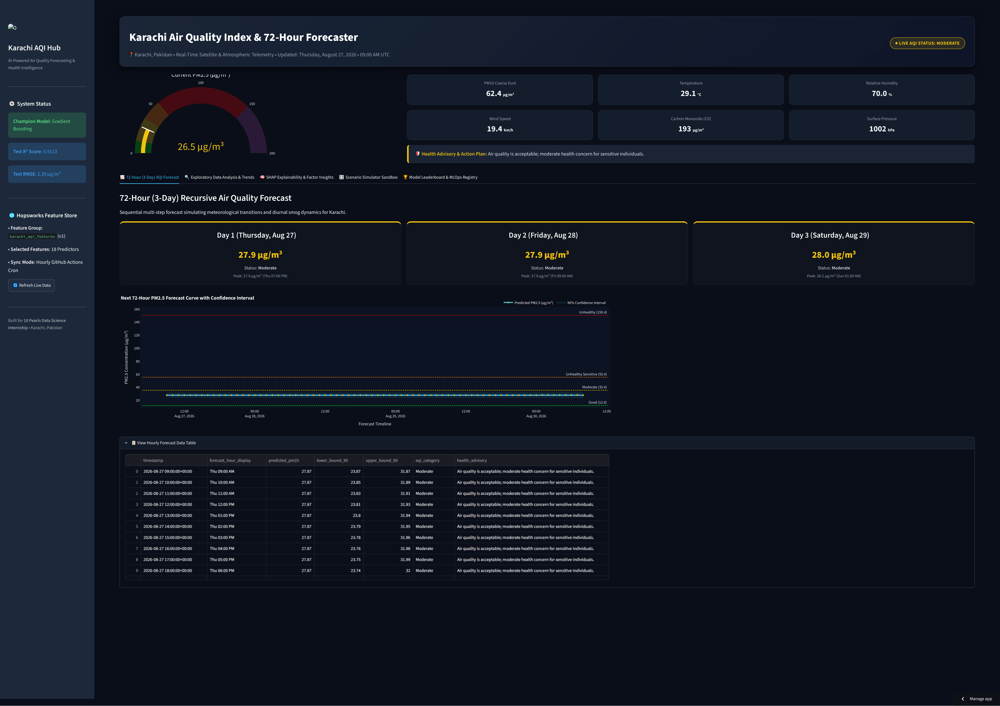
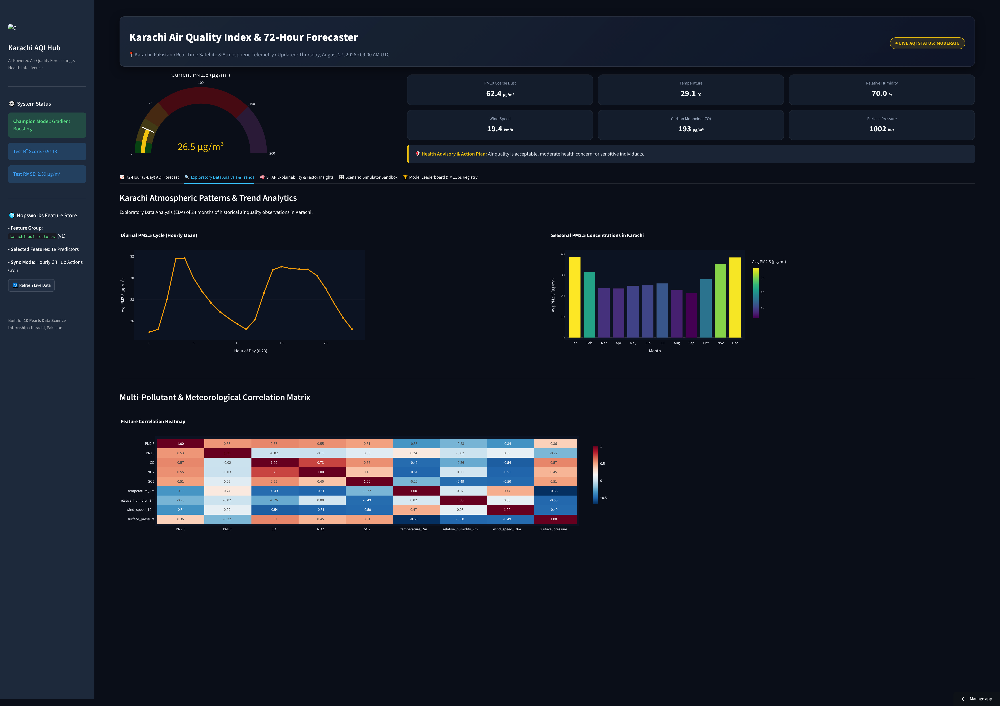
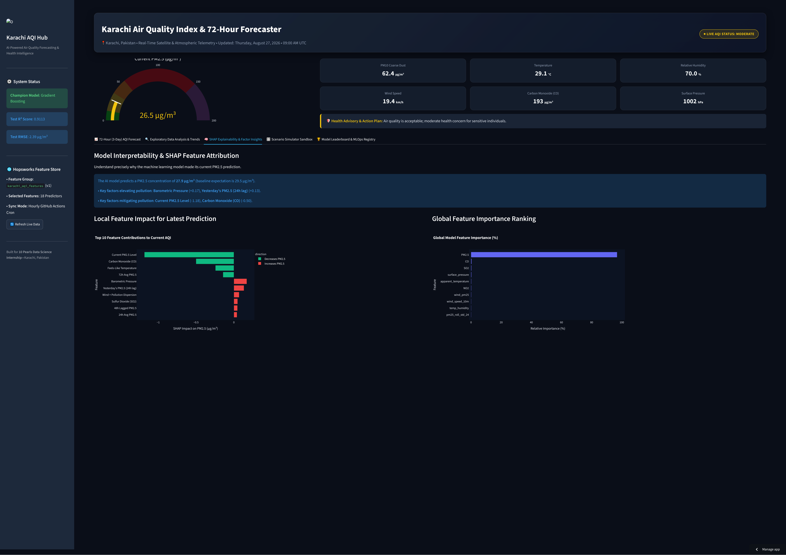
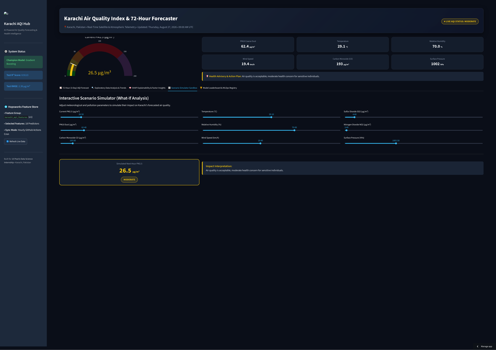
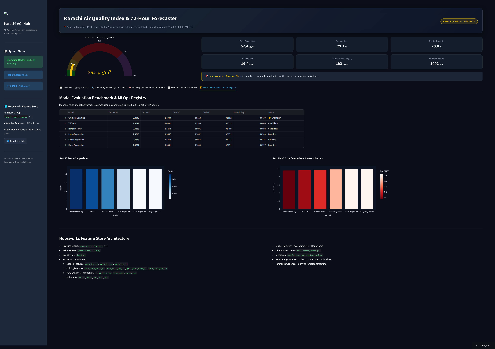
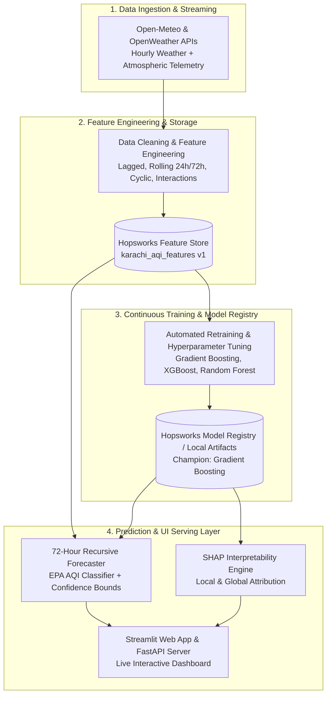

# 🌫️ Karachi AQI Predictor & AI Forecaster

[](https://karachi-aqi-predictor-system.streamlit.app/) [](https://www.python.org/)[](https://www.hopsworks.ai/)[](https://github.com/)[](LICENSE)

An end-to-end, production-grade **MLOps Air Quality Index (AQI) Predictor & 72-Hour Forecaster** for **Karachi, Pakistan**. The system continuously ingests atmospheric telemetry, engineers temporal and meteorological features in **Hopsworks Feature Store**, trains robust machine learning regressors, and serves real-time forecasts and **SHAP explainability** through a modern interactive dashboard.

🔗 **Live Public Dashboard:** [karachi-aqi-predictor-system.streamlit.app](https://karachi-aqi-predictor-system.streamlit.app/)

---

## 📸 Interactive Dashboard Demo

### 1. Real-Time Telemetry & 72-Hour (3-Day) Forecast

> Live EPA PM2.5 gauge, environmental metrics, and multi-step recursive forecast with 90% confidence interval bands.
> 

---

### 2. Exploratory Data Analysis & Diurnal Trends

> Historical patterns, diurnal pollution cycles, seasonal trends, and multi-pollutant cross-correlation matrix.
> 

---

### 3. Explainable AI (XAI) with SHAP

> Instance-level waterfall attribution and global feature importance rankings explaining why the model predicted specific PM2.5 levels.
> 

---

### 4. Interactive Scenario Simulator (What-If Sandbox)

> Real-time simulation sandbox to adjust temperature, humidity, wind, and pollutant levels to evaluate immediate AQI impact.
> 

---

### 5. Model Leaderboard & MLOps Architecture

> Multi-model benchmark evaluation on hold-out test data and Hopsworks Feature Store metadata.
> 

---

## 🏗️ System Architecture & MLOps Workflow



---

## 🏆 Model Benchmark & Performance

The models were evaluated on a chronological hold-out test set (3,427 continuous hourly timestamps):


| Model                 | Test$R^2$ Score | Test RMSE ($\mu\text{g/m}^3$) | Test MAE ($\mu\text{g/m}^3$) | Train$R^2$ | Overfit Gap | Status |        |                |
| :---------------------- | :------------------------------------------------------------------------------: | :----------: | :-----------: | :------: | :------: | :--------------: |
| **Gradient Boosting** |                                   **0.9113**                                   |  **2.39**  |  **1.50**  | 0.9552 | 0.0439 | 🏆**Champion** |
| **XGBoost**           |                                     0.9105                                     |    2.40    |    1.49    | 0.9711 | 0.0606 |   Candidate   |
| **Random Forest**     |                                     0.9091                                     |    2.42    |    1.52    | 0.9789 | 0.0698 |   Candidate   |
| **Lasso Regression**  |                                     0.9062                                     |    2.46    |    1.56    | 0.9271 | 0.0209 |    Baseline    |
| **Linear Regression** |                                     0.9044                                     |    2.48    |    1.58    | 0.9271 | 0.0227 |    Baseline    |
| **Ridge Regression**  |                                     0.9044                                     |    2.49    |    1.59    | 0.9271 | 0.0227 |    Baseline    |

---

## ✨ Key Features & Capabilities

- ⏱️ **Real-Time AQI Monitoring**: Live telemetry of PM2.5, PM10, CO, NO₂, SO₂, temperature, humidity, and surface pressure.
- 🔮 **72-Hour Recursive Forecaster**: Generates hourly future trajectory with 90% confidence bands and day-by-day health advisory cards.
- 📊 **Historical Trend Analytics**: Deep exploratory data analysis across 24+ months, diurnal cycle peaks, and pollutant correlation heatmaps.
- 🧠 **Explainable AI (SHAP)**: Granular transparency breaking down the positive and negative contributors behind every prediction.
- 🎛️ **What-If Scenario Sandbox**: Interactive simulation controls to test environmental conditions and predict smog shifts in real-time.
- 🔄 **Automated CI/CD Workflows**: Scheduled GitHub Actions workflows executing hourly feature extraction and daily model evaluation.

---

## 📂 Project Structure

```
├── .github/workflows/         # Automated CI/CD pipelines
│   ├── feature_pipeline.yml   # Hourly data ingestion & feature store sync
│   └── training_pipeline.yml  # Daily model evaluation & retraining
├── app/                       # Streamlit frontend application
│   ├── streamlit_app.py       # Main interactive dashboard
│   ├── forecast.py            # Recursive 72h multi-step forecaster
│   └── explainability.py      # SHAP interpretability engine
├── config/                    # Configuration files
│   └── config.yml             # Global pipeline parameters & feature definitions
├── data/                      # Data storage
│   ├── raw/                   # Historical and raw collected telemetry
│   └── processed/             # Engineered feature sets
├── docs/images/               # Dashboard screenshots & documentation assets
├── models/                    # Model artifacts & metadata
│   ├── best_model.pkl         # Champion model binary
│   └── best_model_metadata.json
├── pipelines/                 # MLOps pipeline scripts
│   ├── feature_pipeline.py    # Feature extraction & Hopsworks sync
│   ├── training_pipeline.py   # Model training & validation
│   └── prediction_pipeline.py # Inference runner
├── src/                       # Modular source code
│   ├── api_client.py          # Weather & pollution API client
│   ├── feature_engineering.py # Lag, rolling, and cyclic transformers
│   ├── feature_store.py       # Hopsworks feature store connector
│   ├── model_training.py      # Model training routines
│   └── predict.py             # Inference predictor service
├── run_app.py                 # Streamlit entry launcher
├── run_api.py                 # FastAPI backend server
└── requirements.txt           # Python dependencies
```

---

## ⚡ Quick Start & Local Setup

### 1. Clone Repository & Setup Environment

```bash
git clone https://github.com/mdsohaib15/Karachi-AQI-Predictor-.git
cd Karachi-AQI-Predictor-

python -m venv venv
# On Windows:
.\venv\Scripts\activate
# On Linux/macOS:
source venv/bin/activate

pip install -r requirements.txt
```

### 2. Configure Environment Variables

Create a `.env` file in the root directory:

```env
HOPSWORKS_API_KEY=your_hopsworks_api_key
HOPSWORKS_PROJECT_NAME=your_hopsworks_project
OPENWEATHER_API_KEY=your_openweather_api_key   # Optional fallback
```

### 3. Run Pipelines

```bash
# Ingest latest features to Hopsworks
python pipelines/feature_pipeline.py

# Train and benchmark models
python pipelines/training_pipeline.py
```

### 4. Launch Application

```bash
# Launch Streamlit Interactive Dashboard
python run_app.py
# (or: streamlit run app/streamlit_app.py)

# Launch FastAPI REST Server (Optional)
python run_api.py
```

---

## 🌐 Public Deployment & API

- **Web Dashboard:** [https://karachi-aqi-predictor-system.streamlit.app/](https://karachi-aqi-predictor-system.streamlit.app/)
- **FastAPI Endpoints (when running `run_api.py`):**
  - `GET /health` — Service health check
  - `GET /current` — Latest atmospheric observations
  - `GET /forecast` — 72-Hour recursive AQI prediction

---

## 🤝 Acknowledgments

Developed as part of the **10Pearls Data Science Internship** program.
Special thanks to **Hopsworks** for Feature Store infrastructure and **Open-Meteo / OpenWeather** for atmospheric data access.
